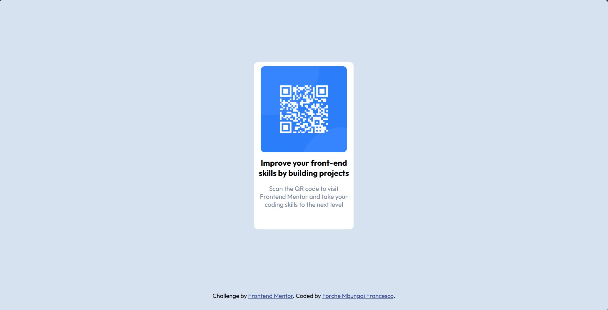

# Frontend Mentor - QR code component solution

This is a solution to the [QR code component challenge on Frontend Mentor](https://www.frontendmentor.io/challenges/qr-code-component-iux_sIO_H). Frontend Mentor challenges help you improve your coding skills by building realistic projects. 

## Table of contents

- [Overview](#overview)
  - [Screenshot](#screenshot)
  - [Links](#links)
- [My process](#my-process)
  - [Built with](#built-with)
  - [What I learned](#what-i-learned)
- [Author](#author)

**Note: Delete this note and update the table of contents based on what sections you keep.**

## Overview

### Screenshot



### Links

- Solution URL:(https://github.com/Mbungai-Francesco/Qr_component)

## My process

### Built with

- Semantic HTML5 markup
- CSS custom properties*

### What I learned

Usings fonts directly from google fonts via link

```html
  <link rel="preconnect" href="https://fonts.googleapis.com">
  <link rel="preconnect" href="https://fonts.gstatic.com" crossorigin>
  <link href="https://fonts.googleapis.com/css2?family=Lato:ital,wght@1,300&family=Outfit:wght@300;400&display=swap" rel="stylesheet">
```
```css
font-family: 'Lato', sans-serif;
    font-family: 'Outfit', sans-serif;
```

## Author

- github - [Forche Mbungai Francesco](https://github.com/Mbungai-Francesco)
- Frontend Mentor - [@Mbungai-Francesco](https://www.frontendmentor.io/profile/Mbungai-Francesco)
- Twitter - [@MbungaiF](https://twitter.com/MbungaiF)